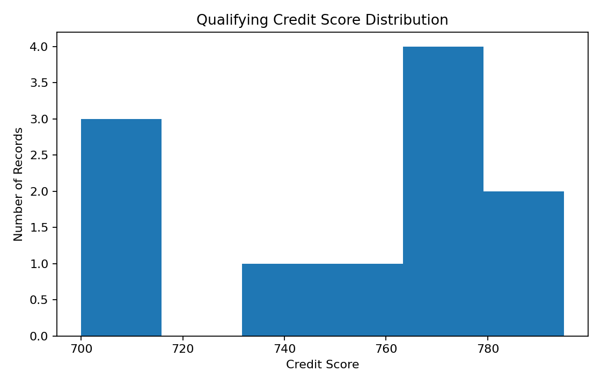
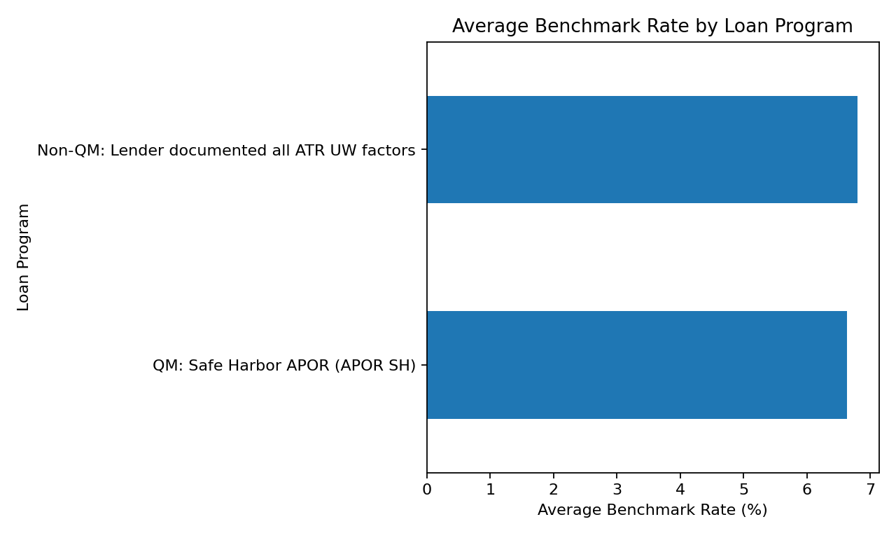
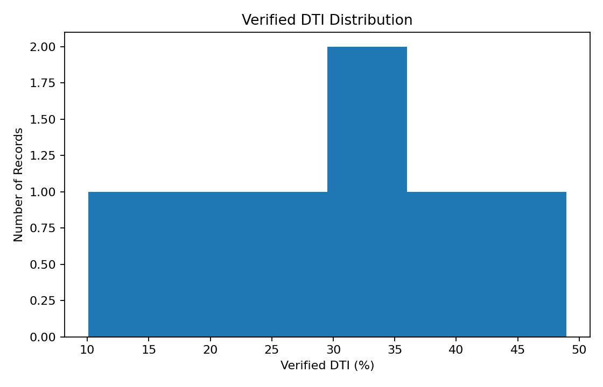

# 📊 Securitisation Data Analysis


## 📌 Project Overview

This project focuses on analyzing securitisation-related data to identify patterns, trends, and meaningful business insights.

The project demonstrates an end-to-end data analysis workflow including data preparation, exploratory analysis, visualization, SQL analysis, and business interpretation.

## 🎯 Objectives

- Clean and prepare the dataset
- Perform exploratory data analysis
- Analyze borrower and loan characteristics
- Identify important trends and patterns
- Analyze credit score and DTI distributions
- Compare benchmark rates across loan programs
- Generate meaningful business insights

## 🛠️ Tools & Technologies

| Technology | Purpose |
|---|---|
| 🐍 Python | Data analysis and automation |
| 🐼 Pandas | Data cleaning and manipulation |
| 🔢 NumPy | Numerical analysis |
| 🗄️ SQL | Data querying and analysis |
| 📊 Excel | Data exploration and reporting |
| 📈 Matplotlib | Data visualization |


## 🔄 Analysis Workflow
```text
Data Collection
      ↓
Data Cleaning
      ↓
Exploratory Data Analysis
      ↓
Statistical Analysis
      ↓
Data Visualization
      ↓
SQL Analysis
      ↓
Business Insights├── README.md
├── data/
├── python/
├── sql/
├── excel/
└── outputs/
```
## 📁 Project Structure

```text
Securitisation-Data-Analysis/
│
├── data/
│   └── securitisation_analysis_dataset.csv
│
├── python/
│   └── analysis.py
│
├── sql/
│   └── analysis_queries.sql
│
├── outputs/
│   ├── analysis_summary.csv
│   ├── benchmark_rate_by_program.png
│   ├── credit_score_distribution.png
│   └── verified_dti_distribution.png
│
├── README.md
└── requirements.txt
```

## 📊 Visualizations

### 📈 Credit Score Distribution



### 📉 Benchmark Rate by Loan Program



### 📊 Verified DTI Distribution



## 🗄️ SQL Analysis

This project includes SQL queries for analyzing the securitisation dataset.

### 🔍 Queries Covered

- Total record count
- Average qualifying credit score
- Average verified DTI
- Loan program distribution
- Average benchmark rate by loan program
- Credit score categorization
- DSCR analysis
- Employment indicator analysis

The complete SQL queries are available in:

`sql/analysis_queries.sql`

## 📈 Key Analysis Areas

### 💳 Credit Risk

Analysis of qualifying credit scores to understand the credit profile of the dataset.

### 📊 Debt-to-Income Ratio

Analysis of verified DTI values to understand borrower financial characteristics.

### 🏦 Loan Programs

Comparison of different loan programs and their characteristics.

### 📉 Benchmark Rates

Analysis of benchmark rates across different loan programs.

### 💰 DSCR Analysis

Analysis of Debt Service Coverage Ratio (DSCR) records to understand debt-service characteristics.

## 💡 Business Insights

The analysis provides a structured view of key securitisation-related characteristics and helps identify patterns that may support data-driven decision-making.

### 🔎 Key Observations

- Credit scores can be analyzed to understand the overall credit profile of the dataset.
- DTI analysis helps identify differences in borrower debt-to-income characteristics.
- Loan program analysis helps compare the characteristics of different programs.
- Benchmark rate analysis provides a basis for comparing rates across loan programs.
- DSCR analysis helps examine debt-service characteristics where DSCR data is available.

> **Note:** These observations are based on the current sample dataset and should not be interpreted as conclusions about the broader securitisation market.

## 🚀 Future Improvements

- Build an interactive Power BI dashboard
- Add advanced SQL queries and analysis
- Add more business KPIs
- Perform deeper statistical analysis
- Automate the data analysis workflow
- Add additional datasets for comparison
- Improve data visualization and reporting

## 👨‍💻 Author

**Akhand Pratap Vishwakarma**

🎓 Computer Science & Engineering Graduate  
📊 Aspiring Data Analyst | Business Analyst

### 🛠️ Skills

`Python` `SQL` `Excel` `Power BI` `MySQL` `Pandas` `NumPy` `Data Visualization`

### 📫 Connect With Me

- 💼 [LinkedIn](https://www.linkedin.com/in/akhand-pratap-vishwakarma-9a7356262/)
- 🐙 [GitHub](https://github.com/Rohan-7408)
- 📧 [Email](mailto:rohanvish78@gmail.com)

---

⭐ **Thank you for exploring this project!**
